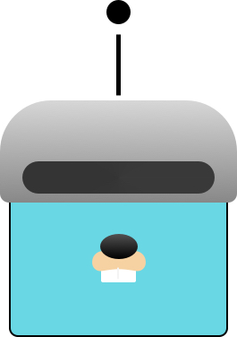

<div align="center">
    
    <h1>IQVBOT</h1>
</div>

[](https://travis-ci.org/quintilesims/slackbot)
[](https://godoc.org/github.com/quintilesims/slackbot)
[](https://goreportcard.com/report/github.com/quintilesims/slackbot)
[](#)
[](https://github.com/quintilesims/slackbot/releases/tag/v0.0.1)

# Overview

IQVBOT is a CLI based slackbot app with many commands and behaviors. Most commands are triggered with a bang `!`, for example to do a gif lookup type `!gif it's working!`. Since this is similar to a CLI application, you can also use expected flags like `!alias -h` to get a help text.

## New to Go?
If you're new to go, we have labeled issues with varying degree of difficulty, we suggest starting at [A Tour of Go](https://tour.golang.org/welcome/) to get started.

## Getting Started

1. First make sure you have all the [requirements](#requirements) installed and ready to go and you have cloned the project to your workspace.
2. You'll have to setup a DyamoDB table with Partition/Primary key named `Key`
3. Next you'll export these keys in your ternimal:

```
export SB_AWS_ACCESS_KEY=awsAccessid
export SB_AWS_SECRET_KEY=awsKey
export SB_DYNAMODB_TABLE=tableName
export SB_SLACK_APP_TOKEN=slackAppToken
export SB_SLACK_BOT_TOKEN=slackBotToken
```

4. You can now run `go run main.go`
5. Navigate to slack and search for the name of the app you created, and try sending `!ping`

## Contributing!

We love open source and we want everyone to be able to. Please reach out if you need help. Feel free to open an issue to discuss a new feature you'd like added.

### Command

1. The [echo command](https://github.com/quintilesims/slackbot/blob/master/bot/echo_command.go) is a great place to get started and you can start by using this as a template. 
2. Once you've created a a command, ou'll add you're command code to main [here](https://github.com/quintilesims/slackbot/blob/master/main.go#L199):

```go
app.Commands = []cli.Command{
  bot.NewBotCommand(w, params),
  ...
}
```

3. Now do `go run main.go` and test you're feature in the app channel on slack.

### Behavior

1. The [karma tracking behavior](https://github.com/quintilesims/slackbot/blob/master/bot/karma_tracking_behavior.go) is a great place to get started for creating a behavior. 
2.  Once you've created a behavior, you'll add you're behavior code to main [here](https://github.com/quintilesims/slackbot/blob/master/main.go#L139):

```go
behaviors := bot.Behaviors{
  bot.NewBehavior(),
    ...
}
```

3. Now do `go run main.go` and test you're feature in the app channel on slack.

## Commands

- `!gif it's working!`
- `!glossary add iqvbot is the best`
- `iqvbot++`
- Full list in the [bot repo](https://github.com/quintilesims/slackbot/tree/master/bot)

### Dependencies

- [Slack API](https://api.slack.com)
- AWS
- [urfave/cli](https://github.com/urfave/cli)
- [quintilesims/slack](https://github.com/quintilesims/slack)

### Requirements

- [AWS Account](https://aws.amazon.com/free/)
- [Slack](https://slack.com/)
- [Slackbot App](https://api.slack.com/apps?new_app=1)
- [Go](https://golang.org/dl/)
