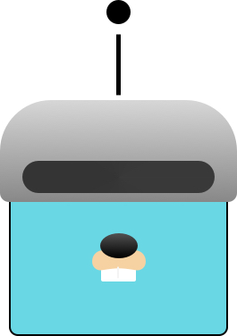

    
    <h1>IQVBOT</h1>

# Overview

- TODO -

# Getting Started
_New to Go? we suggest starting at [A Tour of Go](https://tour.golang.org/welcome/)_

- TODO -

## Contributing

- TODO -

# License
This work is published under the MIT license.

Please see the [LICENSE](https://github.com/quintilesims/slackbot/blob/master/LICENSE) file for details.
